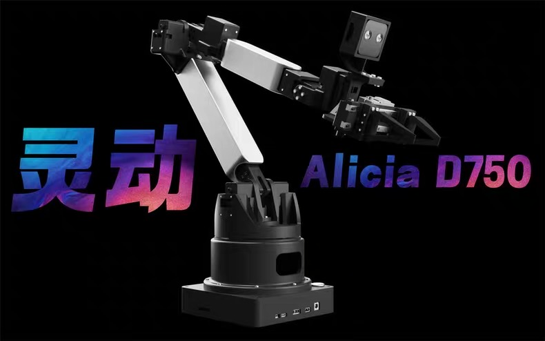
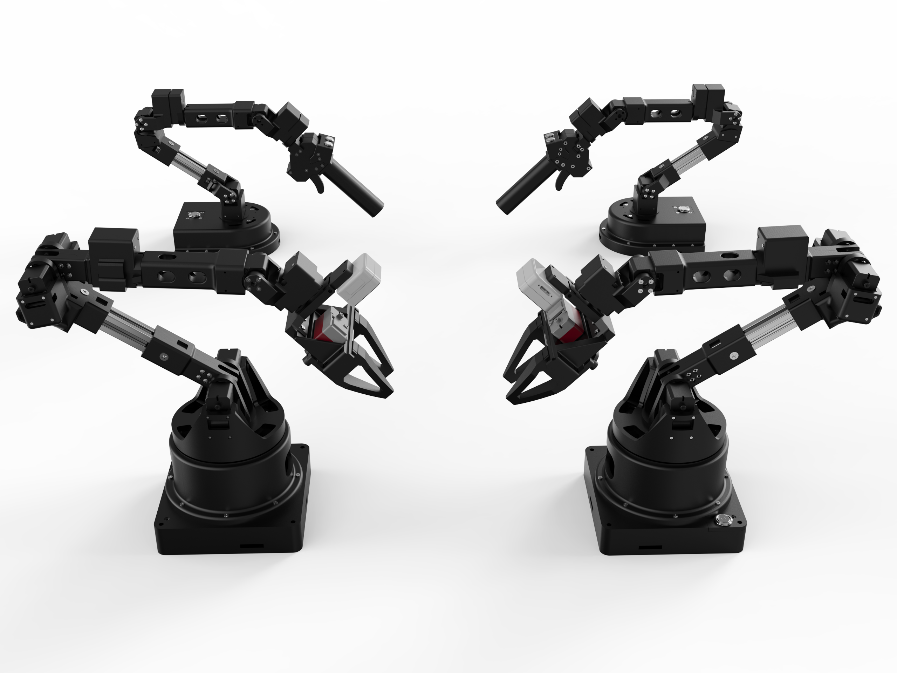
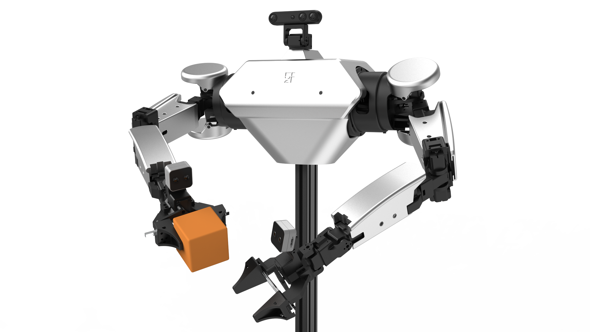

# Synria Robotics 玄雅科技 -  the Future of Humanity

**深圳市玄雅科技有限公司**（Shenzhen Synria Robotics Co., Ltd.）成立于 2024 年，总部位于中国深圳，是一家专注于 **具身智能与远程交互机器人** 的创新型科技企业。核心业务涵盖 **遥操作机器人、一体化远程交互解决方案、先进控制系统** 及 **新一代多模态具身智能算法** 的深度融合。产品广泛适用于工业自动化、远程医疗、教育辅助等场景，具备跨域远程遥操能力、高响应性、精细化操作能力与多模态感知能力，能够满足复杂任务下的人机协同需求。

公司技术体系构建于以下五大核心支柱之上：

- **远程与无线遥操作**：支持低延迟、高精度的人机远程控制，适用于跨地域作业需求  
- **力反馈与触觉交互**：实现操作过程中的触觉同步与力感还原，提升任务执行的可控性与安全性  
- **人体工学驱动的设计理念**：结合人体工学设计示教装置，贴合人体动作习惯，提升操控舒适性与效率
- **共享与自适应控制机制**：支持人与机器人共享控制，控制权可动态调整，实现高效、安全、便捷的人机协作
- **多模态具身智能算法**：融合视觉、触觉、语义等多源感知信息，支撑真实环境下的智能行为生成  

<table border="1" cellspacing="0" cellpadding="6" style="border-collapse: collapse; width: 100%; text-align: left;">
  <colgroup>
    <col width="30%">
    <col width="30%">
    <col width="40%">
  </colgroup>
  <thead>
    <tr>
      <th style="width: 30%;">产品</th>
      <th style="width: 30%;">仓库</th>
      <th>描述</th>
    </tr>
  </thead>
  <tbody>
    <tr>
      <td rowspan="6"><strong>Alicia-D灵动系列</strong> 舵机桌面六轴机械臂
        
       
      </td>
      <td><a href="https://github.com/Synria-Robotics/Alicia-D-SDK">Alicia-D-SDK</a></td>
      <td>Python SDK，用于控制 Alicia-D 六轴机械臂，包括状态读取、关节控制、末端位姿控制、夹爪控制、正逆运动学等功能</td>
    </tr>
    <tr>
      <td><a href="https://github.com/Synria-Robotics/Alicia-D-ROS1">Alicia-D-ROS1</a></td>
      <td>ROS1 控制包，包含驱动、MoveIt 配置、拖动示教与抓取等示例</td>
    </tr>
    <tr>
      <td><a href="https://github.com/Synria-Robotics/Alicia-D-ROS2">Alicia-D-ROS2</a></td>
      <td>ROS2 Humble 支持，标准话题接口与完整控制链路</td>
    </tr>
    <tr>
      <td><a href="https://github.com/Synria-Robotics/Alicia-D-Leader-ROS">Alicia-D-Leader-ROS</a></td>
      <td>示教臂（Leader）ROS 驱动，可读取关节状态并发布为自定义消息</td>
    </tr>
    <tr>
      <td><a href="https://github.com/Synria-Robotics/Alicia-D-VLM-Grasp">Alicia-D-VLM-Grasp</a></td>
      <td>基于视觉语言模型（VLM）的语义抓取示例，集成阿里云百炼 API</td>
    </tr>
    <tr>
      <td><a href="https://github.com/Synria-Robotics/lerobot">lerobot</a></td>
      <td>机器人学习与数据采集框架，用于模仿学习、遥操作配套使用</td>
    </tr>
    <tr>
      <td rowspan="2"><strong>Bessica-D灵越系列</strong> 舵机双臂人形机器人
      
      </td>
      <td><a href="https://github.com/Synria-Robotics/Bessica-D-SDK">Bessica-D-SDK</a></td>
      <td>Python SDK，支持串口通信与状态读取、双臂关节控制、夹爪控制</td>
    </tr>
    <tr>
      <td><a href="https://github.com/Synria-Robotics/Bessica-D-ROS1">Bessica-D-ROS1</a></td>
      <td>ROS1 控制包，支持双臂同步控制、状态读取与 MoveIt 接口</td>
    </tr>
  </tbody>
</table>

更多信息详见:
[GitHub](https://github.com/Synria-Robotics) | [Gitee](https://gitee.com/Synria-Robotics) | [Taobao](https://m.tb.cn/h.h2cVdhu5JXDQvPu) | [Website](https://www.xuanyatech.com/) | [Sparkling 手册](https://docs.sparklingrobo.com/)