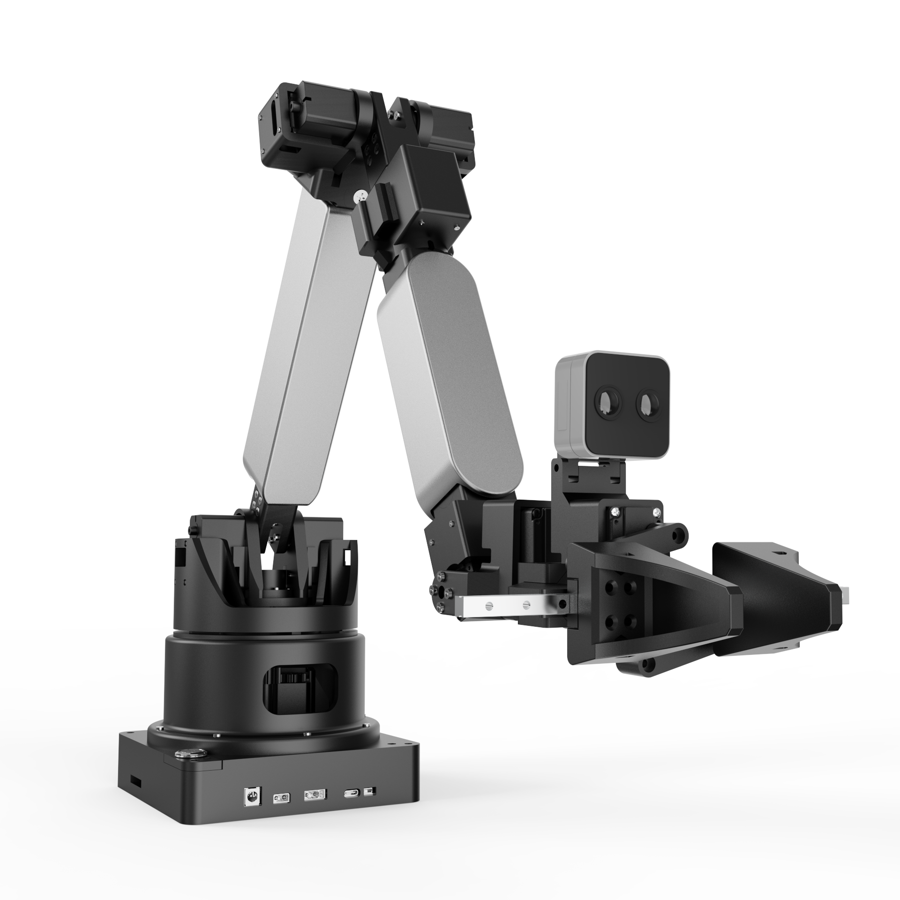
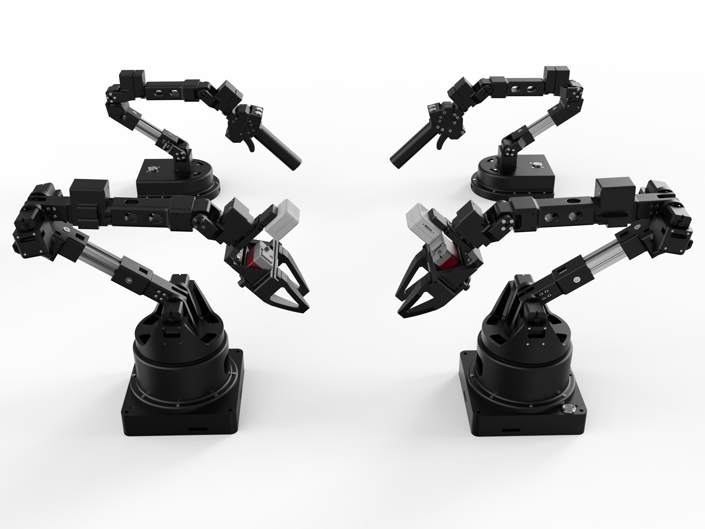
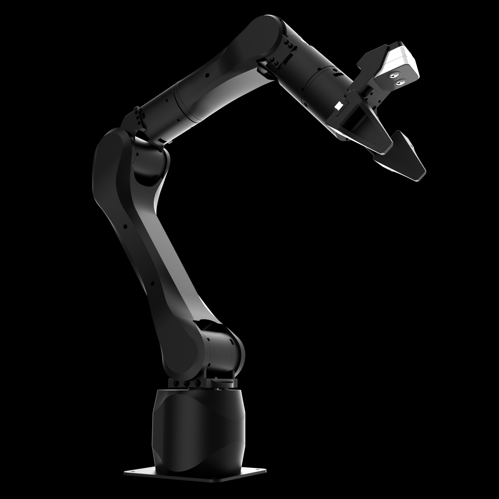
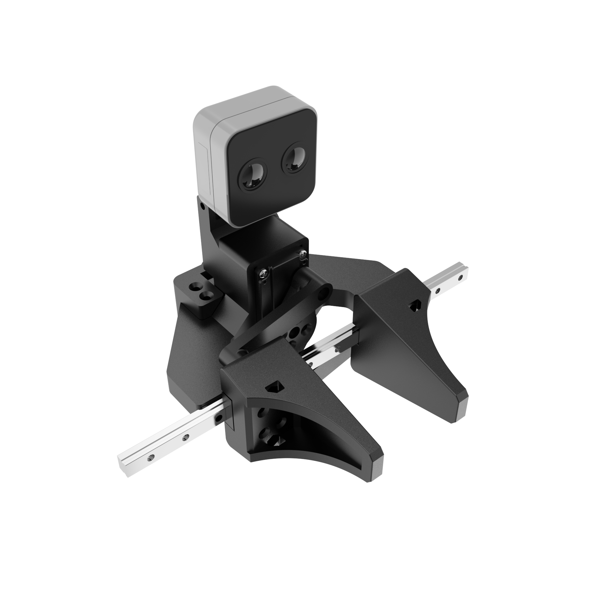
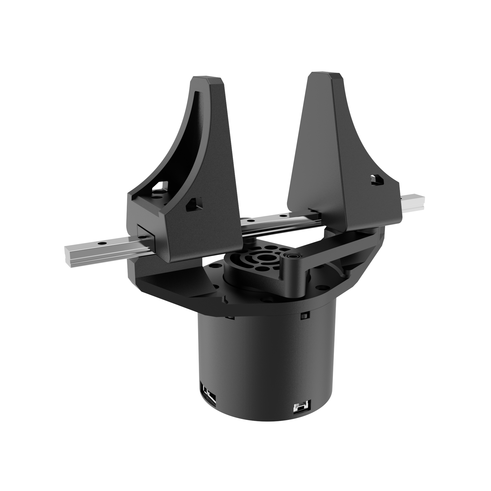
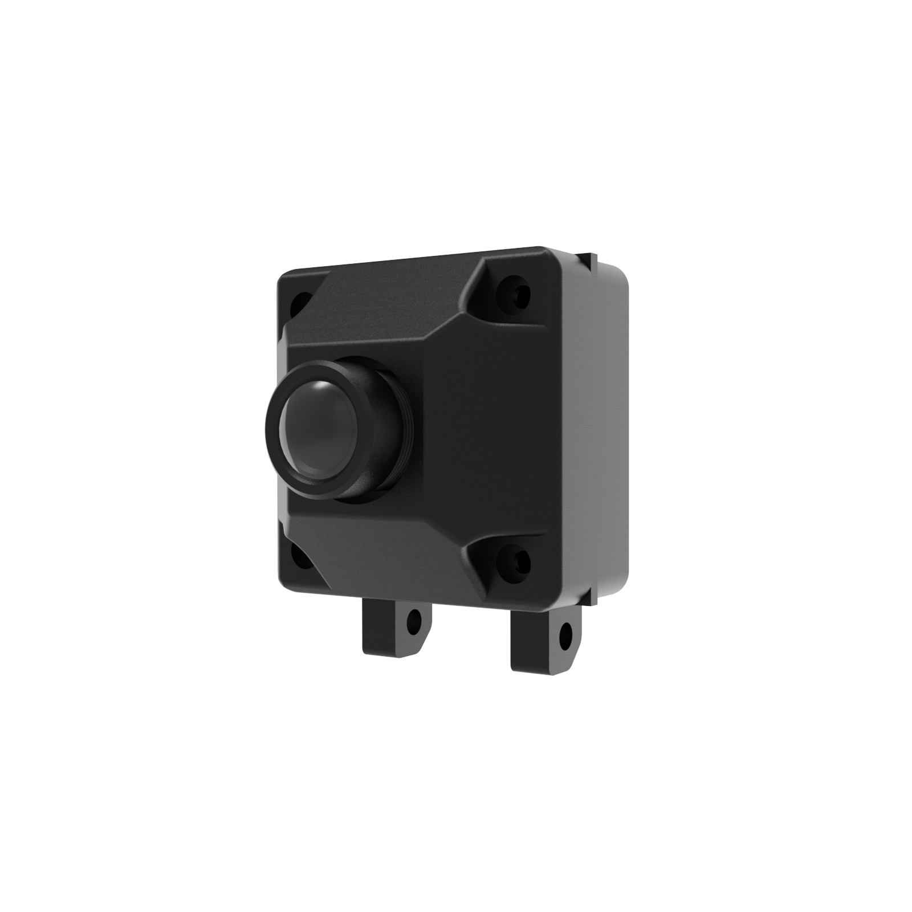

# Synria Robotics 玄雅科技 -  the Future of Humanity

**Shenzhen Synria Robotics Co., Ltd.**, founded in 2024 and headquartered in Shenzhen, China, is an innovative technology enterprise specializing in **embodied intelligence and teleoperated robotic systems**. The company focuses on the deep integration of **Teleoperated robots**, **End-to-end remote interaction solutions**, **Advanced control systems**, and **Next-generation multimodal embodied intelligence algorithms**. Our products are widely applicable in scenarios such as industrial automation, remote healthcare, and educational assistance. Key capabilities include **cross-domain remote operation**, **high responsiveness**, **fine manipulation**, and **multimodal perception**, enabling efficient human-robot collaboration in complex tasks.

The company’s technical architecture is built on five core pillars:

- **Remote and Wireless Teleoperation**: Enables low-latency, high-precision remote control across geographic boundaries, suitable for distributed task execution.  
- **Force Feedback and Tactile Interaction**: Provides haptic synchronization and force rendering during operation, enhancing controllability and operational safety.  
- **Ergonomics-Driven Design Philosophy**: Incorporates ergonomically designed teaching interfaces that align with natural human motion, improving operator comfort and efficiency.  
- **Shared and Adaptive Control Mechanism**: Supports shared control between humans and robots with dynamically adjustable control authority, enabling efficient, safe, and intuitive collaboration.  
- **Multimodal Embodied Intelligence Algorithms**: Integrates visual, tactile, and semantic signals to support intelligent behavior generation in real-world environments.  

<table border="1" cellspacing="0" cellpadding="6" style="border-collapse: collapse; width: 100%; text-align: left;">
  <colgroup>
    <col width="30%">
    <col width="30%">
    <col width="40%">
  </colgroup>
  <thead>
    <tr>
      <th>Product</th>
      <th>&nbsp;&nbsp;&nbsp;&nbsp;&nbsp;&nbsp;&nbsp;&nbsp;&nbsp;Repository&nbsp;&nbsp;&nbsp;&nbsp;&nbsp;&nbsp;&nbsp;&nbsp;&nbsp;</th>
      <th>Description</th>
    </tr>
  </thead>
  <tbody>
    <tr>
      <td rowspan="6"><strong>Alicia-D Series</strong> 6-DOF Servo Arm
         
        
      </td>
      <td><a href="https://github.com/Synria-Robotics/Alicia-D-SDK">Alicia-D-SDK</a></td>
      <td>A Python SDK for controlling the Alicia-D 6-DOF robotic arm. Features include state reading, joint control, end-effector pose control, gripper control, forward/inverse kinematics, and more.</td>
    </tr>
    <tr>
      <td><a href="https://github.com/Synria-Robotics/Alicia-D-ROS1">Alicia-D-ROS1</a></td>
      <td>ROS1 control package with drivers, MoveIt configuration, drag-teaching, and grasping examples.</td>
    </tr>
    <tr>
      <td><a href="https://github.com/Synria-Robotics/Alicia-D-ROS2">Alicia-D-ROS2</a></td>
      <td>ROS2 Humble support with standard topic interfaces and a complete control pipeline.</td>
    </tr>
    <tr>
      <td><a href="https://github.com/Synria-Robotics/Alicia-D-Leader-ROS">Alicia-D-Leader-ROS</a></td>
      <td>ROS driver for the leader arm, providing joint state reading and publishing as custom messages.</td>
    </tr>
    <tr>
      <td><a href="https://github.com/Synria-Robotics/Alicia-D-VLM-Grasp">Alicia-D-VLM-Grasp</a></td>
      <td>Vision-Language Model (VLM) based semantic grasping example, integrating Alibaba Cloud Bailian API.</td>
    </tr>
    <tr>
      <td><a href="https://github.com/Synria-Robotics/lerobot">lerobot</a></td>
      <td>Robot learning and data collection framework for imitation learning and teleoperation workflows.</td>
    </tr>
    <tr>
      <td rowspan="2"><strong>Alicia-M Series</strong> Motor-Driven 6-DOF Force-Control Arm 
        
      </td>
      <td><a href="https://github.com/Synria-Robotics/Alicia-M-SDK">Alicia-M-SDK</a></td>
      <td>Python SDK supporting serial communication, state reading, joint control, and gripper control for the Alicia-M arm.</td>
    </tr>
    <tr>
      <td><a href="https://github.com/Synria-Robotics/Alicia-M-ROS2">Alicia-M-ROS2</a></td>
      <td>ROS2 control package providing synchronized control, state reading, MoveIt integration, and hand–eye calibration support.</td>
    </tr>
    <tr>
      <td rowspan="1"><strong>Gloria-D Series</strong> Parallel Two-Finger Servo Gripper 
        
      </td>
      <td><a href="https://github.com/Synria-Robotics/Gloria-D-SDK">Gloria-D-SDK</a></td>
      <td>Python SDK supporting serial communication and both force-control and non-force-control modes.</td>
    </tr>
    <tr>
      <td rowspan="1"><strong>Gloria-M Series</strong> Force-Control Parallel Two-Finger Gripper 
        
      </td>
      <td><a href="https://github.com/Synria-Robotics/Gloria-M-SDK">Gloria-M-SDK</a></td>
      <td>Python SDK with TTL-to-CAN communication, supporting position, velocity, and torque state reading and control, with switchable MIT and PV motor control modes.</td>
    </tr>
    <tr>
      <td rowspan="1"><strong>Synria-C10 Camera</strong> USB Camera 
        
      </td>
      <td><a href="https://github.com/Synria-Robotics/Synria-C10-SDK">Synria-C10-SDK</a></td>
      <td>Supports RGB image acquisition via the Python SDK.</td>
    </tr>
  </tbody>
</table>

For more information, please refer to:  
[GitHub](https://github.com/Synria-Robotics) | [Gitee](https://gitee.com/Synria-Robotics) | [Taobao](https://m.tb.cn/h.h2cVdhu5JXDQvPu) | [Website](https://www.xuanyatech.com/) | [Sparkling Docs](https://docs.sparklingrobo.com/)
